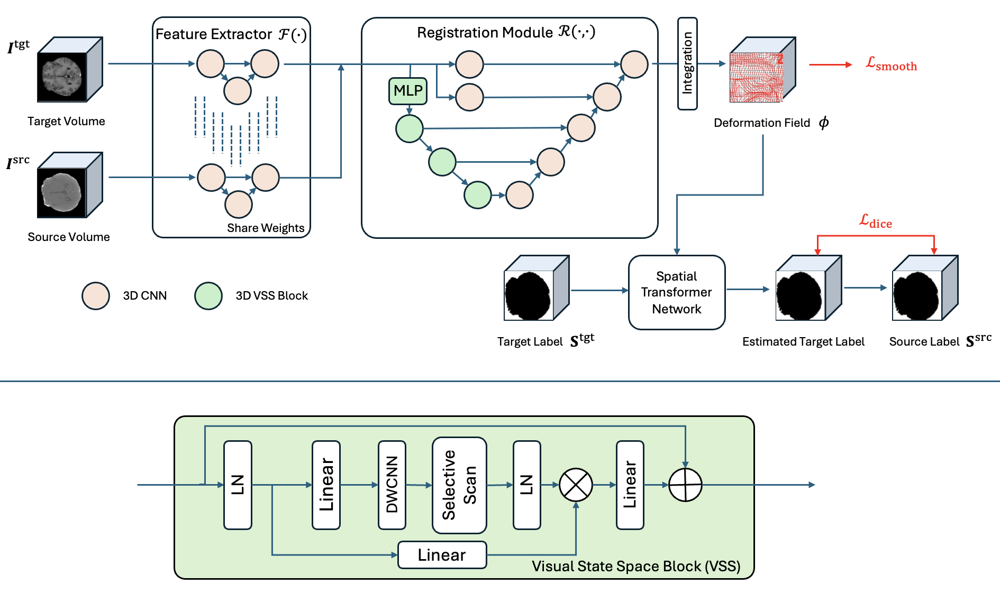
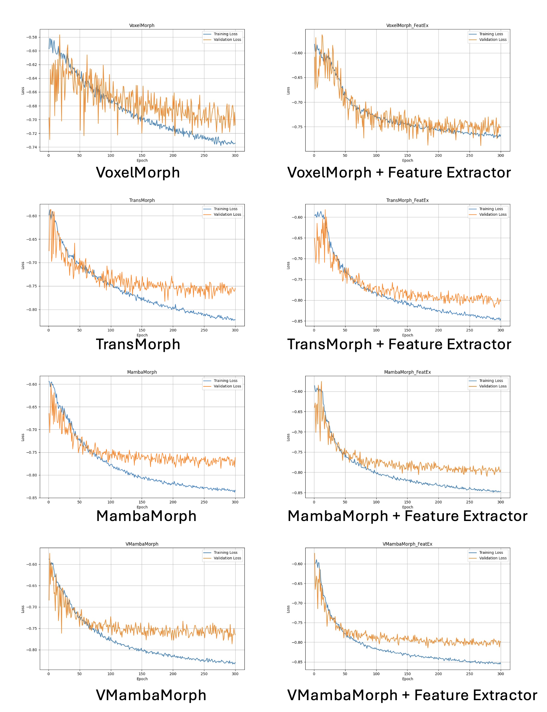
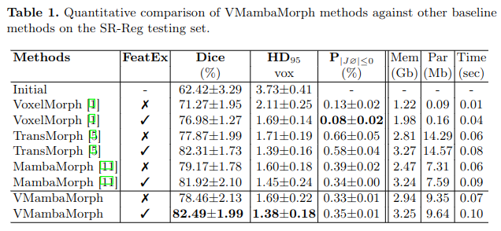

<div align="center">
<h1> <b>VMambaMorph</b>: a Visual Mamba-based Framework with Cross-Scan Module for Deformable 3D Image Registration </h1>
</div>

> This repo provides an implementation of the training and inference pipeline for VMambamorph. 

## Graphical Abstract







## Contents ###
- [Requirements](#requirements)
- [Usage](#usage)
- [Reference](#reference)
  
## Requirements

`pip install mamba-ssm`

Linux
NVIDIA GPU
PyTorch 1.12+
CUDA 11.6+


## Usage

1. Clone the repo:
```
git clone https://github.com/ziyangwang007/VMambaMorph.git 
cd VMambaMorph
```

2. Dataset:
Download the SR-Reg dataset [Official Page](https://github.com/Guo-Stone/MambaMorph). 
(Please be aware the input size is 128x128x128 in the VMambaMorph project, due to memory cost.)

3. Train VoxelMorph (With or Without Feature Extractor)
```
python ./scripts/torch/train_cross.py --gpu 0 --epochs 300 --batch-size 1 --model-dir output/train_debug_vm --model vm
python ./scripts/torch/train_cross.py --gpu 0 --epochs 300 --batch-size 1 --model-dir output/train_debug_vmfeat --model vm-feat
```

4. Train TransMorph (With or Without Feature Extractor)
```
python ./scripts/torch/train_cross.py --gpu 0 --epochs 300 --batch-size 1 --model-dir output/train_debug_tm --model tm
python ./scripts/torch/train_cross.py --gpu 0 --epochs 300 --batch-size 1 --model-dir output/train_debug_tmfeat --model tm-feat
```

5. Train MambaMorph (With or Without Feature Extractor)
```
python ./scripts/torch/train_cross.py --gpu 0 --epochs 300 --batch-size 1 --model-dir output/train_debug_mm --model mm
python ./scripts/torch/train_cross.py --gpu 0 --epochs 300 --batch-size 1 --model-dir output/train_debug_mmfeat --model mm-feat
```

6. Train VMambaMorph (With or Without Feature Extractor)
```
python ./scripts/torch/train_cross.py --gpu 0 --epochs 300 --batch-size 1 --model-dir output/train_debug_vm --model vmm
python ./scripts/torch/train_cross.py --gpu 0 --epochs 300 --batch-size 1 --model-dir output/train_debug_vmfeat --model vmm-feat
```

7. Test
```
python ./scripts/torch/test_cross.py --gpu 0 --model XXX --load-model "Your Path/output/train_debug_xxx/min_train.pt"
```

## Reference
```
@article{wang2024vmambamorph,
  title={VMambaMorph: a Visual Mamba-based Framework with Cross-Scan Module for Deformable 3D Image Registration},
  author={Wang, Ziyang and Zheng, Jianqing and Ma, Chao and Guo, Tao},
  journal={arXiv preprint arXiv:2402.xxxxx},
  year={2024}
}

@article{guo2024mambamorph,
  title={Mambamorph: a mamba-based backbone with contrastive feature learning for deformable mr-ct registration},
  author={Guo, Tao and Wang, Yinuo and Meng, Cai},
  journal={arXiv preprint arXiv:2401.13934},
  year={2024}
}
```


## Contact

ziyang [dot] wang17 [at] gmail [dot] com


## Acknowledgement
Mamba [Link](https://github.com/state-spaces/mamba), Mambamorph [Link](https://github.com/Guo-Stone/MambaMorph), VMamba [Link](https://github.com/MzeroMiko/VMamba), TransMorph [Link](https://github.com/junyuchen245/TransMorph_Transformer_for_Medical_Image_Registration).
